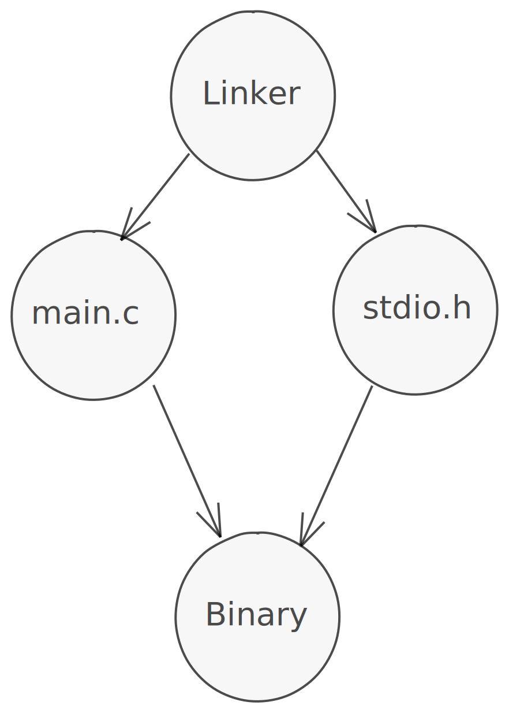

# Compiler Deep Dive

## Breaking down Compilation

In the previous section, we told our compiler to generate an executable binary from our source code. While the compiler does it all in one step for us, there's a bit more happening behind the scenes.

First, the compiler turns your C code into equivalent assembly code.

Then, the compiler turns your assembly code into an object file, which is machine code that your computer can read.

Finally, the compiler links your object file with its required dependencies (remember that stdio.h file we included at the top?), and generates an executable binary that your computer can run.

## Generating Assembly

We said in the History chapter that C and C++ compile to assembly.

Let's prove that.

Instead of compiling to a binary like we did in the last section, we'll go ahead and compile our C code to assembly.

On Mac and Linux, that is as simple as providing an extra flag to gcc.

Run the following command in the terminal.

```sh
gcc -S main.c
```

On Windows:

```sh
cl /FA main.c
```

You should notice a file with the same name as your file, but with a file extension of .s (or .asm for Windows).

Let's take a look at some of the code (the output depends on your compiler and computer, so don't worry if it looks different from this output).

```asm,editable
{{#include ../../code/basic-c/hello_world.s}}
```

Even if we can't read this code, you should notice that we have our "Hello world" string located in the string section of the assembly, and the \_printf function being called by the assembly. That pretty much mirrors what we've been doing with our C code.

## Compiling C++ to assembly

We can compile the exact same code to assembly and see what the output is as well, since our hello world program in C is a valid C++ program.

First, write the exact same file and save it as hello_world.cpp.

(As a side note, .cpp and .cc are both valid extensions for C++ code. Some people prefer .cpp, and some people prefer .cc).

```cpp,editable
{{#include ../../code/basic-c/hello_world.cpp}}
```

In general, your C compiler can double as a C++ compiler -- at least in the case of gcc, Clang, and MSVC.

To compile our C++ file to assembly, run the following.

On Mac and Linux, that is as simple as providing an extra flag to g++.

Run the following command in the terminal.

```sh
g++ -S main.c
```

On Windows:

```sh
cl /TP /FA main.c
```

You should see the same hello_world.s or hello_world.asm file as output.

```asm,editable
{{#include ../../code/basic-c/hello_world_cpp.s}}
```

In my case, it generated the exact same code. But it might not.

## Object Files and Compilation

After the compiler is done generating assembly, it will generate some object files for you, which are ready to be linked with other dependencies into the final executable.

We can create object files similarly to the way we did the assembly, by providing our compiler a different flag.

On Linux and Mac:

```sh
gcc main.c -c
```

On Windows:

```sh
cl /c main.c
```

You should get some output that isn't readable by your computer. But that's ok. It's not meant to be human readable, as it's in a form that your computer can read.

Make sure to save that object file for our last step.

## Linking

Finally, we come to linking. The object file that we generated in the last step is machine readable, but it doesn't have all of its dependencies. We are calling the `printf` function from `<stdio.h>`, but all we've done is transform our source code into something machine readable. Where are we going to get that printf function?

Let's give our object file that function.

Graphically, the linker takes our main.c file and the `stdio.h` file from the C standard library and forms an executable with them.



In Linux and Mac, the linker is called `ld`.
Run the following command to link the object file with the C standard library.
The command line flag `-lc` means "link with the C standard library" ("l" for link, and "c" for the standard library).

```sh
ld main.o -lc
```

This will give us our `a.out` file that we had in the last section which is now executable.

Run it again to get right back to where we left off last section.

```sh
./a.out
Hello world
```

We can try to create an executable without linking it to the c standard library.
Run this command to try that out.

```sh
ld main.o
```

For me that fails with this output:

```sh
Undefined symbols for architecture x86_64:
  "_printf", referenced from:
      _main in hello_world.o
ld: symbol(s) not found for architecture x86_64
```

We're trying to generate a binary, but as the linker goes through the file, it tries to resolve the name of the function `_printf`. In this case, since our file does not define a function named `printf`, and since there was nothing linked that defines `printf`, the linker throws an error and cannot compile our file.

## Conclusion

As we can see here, our compiler is doing three tasks for us.

First, it checks to make sure that our program is a valid C program.
Second, it generates assembly that corresponds to our C program.
Third, it creates an optimized object file that is machine readable.
Fourth, it links in any dependencies that are required to run the file.

You'll notice that we don't have to provide the -lc flag to the compiler to link our source code to the C standard library, but when we manually use the linker, we do. As well, the compiler is much faster than us manually going through the steps using the compiler and the linker.

## Exercises

- Try to run through the exact same pipeline (generating assembly, generating an object file, and linking) with a program that says hello to you.

## Extra Resources

- [What do linkers do?, StackOverflow](https://stackoverflow.com/questions/3322911/what-do-linkers-do)
- [Introduction to the Compiler, Linker, Libraries, Learncpp](https://www.learncpp.com/cpp-tutorial/introduction-to-the-compiler-linker-and-libraries/)
