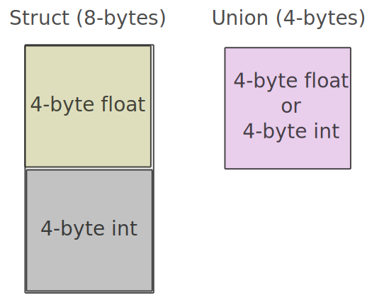

# Unions

Unions are a user-defined type that are memory efficient. They are used to define a type that can be one of a group of types.

# Unions

Let's take a look.

```c,editable
{{#include ../../code/basic-c/unions/basic.c}}
```

Here, we define a union type we call `num` that can be one of two things: a float or an int.

Then, we create our own instance of this type called `number`, and say we want it to be an integer. We assign the value we want to this variable's `i` member, and then print it out.

This prints out 10 when compiled and run. Great.

If you squint a little bit, and replace the keyword `union` with `struct`, you'll notice a lot of similarities. They're similar in the way you declare them, but different in two crucial parts: how you use them (and shouldn't) and how they are laid out in memory.

## Memory layout of a Union

A struct always contains enough memory for the sum of its members.
If we declared a struct like so:

There is one 4-byte member, and another 4-byte member. This is in total 8-bytes.

```c,editable
{{#include ../../code/basic-c/unions/example_struct.c}}
```

Looking back to our union, it looks about the same:

But a union only takes up as much as space as its largest member.

We have two 4-byte members, so the union takes up 4-bytes.

```c,editable
{{#include ../../code/basic-c/unions/basic.c4:7}}
```



Thus, a union can be a more packed representation of a struct if you only need to use one of the possible data members.

## How not to use a Union

Unions are tricky to use, to say the least:

Since they only take up the size of their largest member, you can only read from the field of a union that you last wrote to, otherwise you get undefined behavior.

```c,editable
{{#include ../../code/basic-c/unions/union_misuse.c}}
```

Here, I write a value to the `int` portion of the union, then the `float` portion, then I try to read the int. I get this:

```sh
1084227584
```

Completely wrong, and undefined behavior.

## More Resources

[Unions in C](https://www.programiz.com/c-programming/c-unions)
