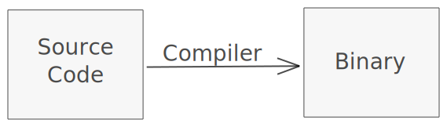

# Writing and Compiling C

Since C is a compiled langauge, you'll need something called a compiler to turn your files containing C code (known as source files) into something your computer can read.

That looks something like this:



Let's get a compiler.

## Installing a C compiler

- On Linux, you most likely already have a C compiler. The compiler is called `gcc`, and will work for our purposes. Feel free to make sure you have it by running `which gcc` in a terminal window, and if the comamnd shows you where gcc is, you're ready to move on.

  - If you don't have gcc on your computer, you can find it in your package repository. On Debian based distros, `sudo apt install gcc` or `sudo apt install build-essential` should install it in the right location for you.

- On Mac, you can get gcc (which is actually clang in disguise, another C compiler) by running `xcode-select install` in a terminal window, and following the steps provided. You can check to make sure that this worked correctly by typing in `which gcc`, and if the command shows you where gcc is, you're ready to move on.

- On Windows, you'll want to follow the directions here: [Installing a C compiler on Windows](https://docs.microsoft.com/en-us/cpp/build/vscpp-step-0-installation?view=msvc-160)

## Writing some Source Code

Let's write some source code.

Write the following code in a file and call it `main.c`.

```c,editable
// main.c
{{#include ../../code/basic-c/hello_world.c}}
```

Let's break it down a little bit.

The first line starts with `#include`, and brings in the contents of the file `stdio.h` to our file. This lets us access a special function called `printf` which we use later in the program.

```c,editable
// main.c
{{#include ../../code/basic-c/hello_world.c:1}}
```

The second part starts with `int main() {`.

In C, you must define a special function called `main`, which will be executed in order as the program runs. The `main` function must always be defined in a C program.

```c,editable
// main.c
{{#include ../../code/basic-c/hello_world.c:3}}
// some content here
{{#include ../../code/basic-c/hello_world.c:6}}
```

In our case, we call a function called `printf` to print the string "Hello world" (a string is a collection of characters enclosed in double quotes `"`).

Finally in the `main` function, there is a `return 0;`. (This can be omitted from a C program, assuming you're using a compiler that is on a standard of C99 or later.) This `return 0;` satisfies the `int` part of the `main` function, which requires that an `int` (short for Integer) is returned by the function.

Don't worry if everything isn't crystal clear, we'll go back and explain later on.

## Compiling your Code

Now you can compile your code:

In the terminal, write the following:

```sh
${C Compiler} ${path_to_file}
```

On Linux:

```sh
gcc main.c
```

On Mac:

```sh
gcc main.c
```

On Windows:

```sh
cl main.c
```

On linux and Mac, you should notice an `a.out` file in your directory as the output of the comamnd.

On Windows, you should notice a main.exe file.

This file is called a `Binary`, and is the compiled version of your program. You can now run it!

## Running your Code

Now it's time to run your code.

On Linux and Mac, it's as simple as running `./a.out` in the terminal of the directory that you're located.

On Windows, it's even easier -- just double click to see the output.

You should see "Hello World" on your screen. With that, we've learned how to write, compile, and run our very first C program.

## Exercises

- Change the source code above to say "Hello" to you, instead of to the world.

<details>
  <summary>Answer</summary>

```c,editable
{{#include ../../code/basic-c/hello_person.c}}
```

</details>

## Extra Resources

- [A Crash Course in C, MIT](https://stuff.mit.edu/iap/2007/c/CrashCourseC.html)
